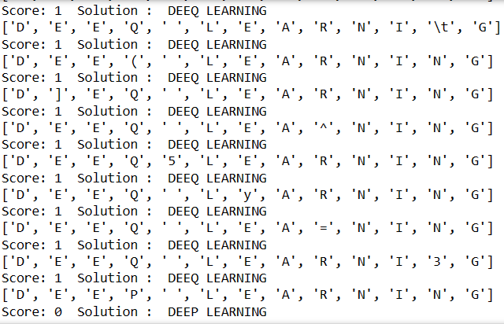

## ExpNo 4 : Implement Simple Hill Climbing Algorithm
## Name: M.Hariharan
## Register Number:212221230034
## Aim:
Implement Simple Hill Climbing Algorithm and Generate a String by Mutating a Single Character at each iteration.

## Theory:
Hill climbing is a variant of Generate and test in which feedback from the test procedure is used to help the generator decide which direction to move in the search space. Feedback is provided in terms of a heuristic function.

## Algorithm:
1. Evaluate the initial state. If it is a goal state, then return it and quit. Otherwise, continue with the initial state as the current state.
2. Loop until a solution is found or there are no new operators left to be applied in the current state:
   - Select an operator that has not yet been applied to the current state and apply it to produce a new state.
   - Evaluate the new state:
     - If it is a goal state, then return it and quit.
     - If it is not a goal state but better than the current state, then make the new state the current state.
     - If it is not better than the current state, then continue in the loop.

## Steps Applied:
### Step-1
Generate a Random String of the same length as the given String.
### Step-2
Mutate the randomized string one character at a time.
### Step-3
Evaluate the fitness function or Heuristic Function.
### Step-4
Loop through Step-2 and Step-3 until we achieve a score of Zero to reach the Global Minima.

## Program
```python
import random
import string
def generate_random_solution(answer):
    l=len(answer)
    return [random.choice(string.printable) for _ in range(l)]
def evaluate(solution,answer):
    print(solution)
    target=list(answer)
    diff=0
    for i in range(len(target)):
        s=solution[i]
        t=target[i]
        diff +=abs(ord(s)-ord(t))
    return diff
def mutate_solution(solution):
    ind=random.randint(0,len(solution)-1)
    solution[ind]=random.choice(string.printable)
    return solution
def SimpleHillClimbing():
    answer="DEEP LEARNING"
    best=generate_random_solution(answer)
    best_score=evaluate(best,answer)
    while True:
        print("Score:",best_score," Solution : ","".join(best))  
        if best_score==0:
            break
        new_solution=mutate_solution(list(best))
        score=evaluate(new_solution,answer)   
        if score<best_score:
            best=new_solution
            best_score=score
answer="DEEP LEARNING"
print(generate_random_solution(answer))
solution=generate_random_solution(answer)
print(evaluate(solution,answer))
SimpleHillClimbing()
```
## Output 
String : DEEP LEARNING


## Result
The Simple Hill Climbing Algorithm successfully mutated a random string to optimize and generate the target string 'DEEP LEARNING' by iteratively improving the solution.
